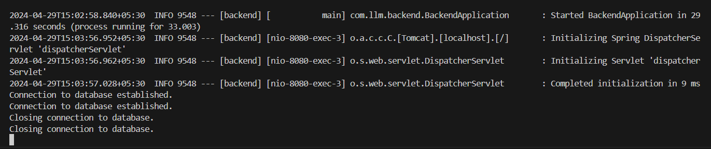
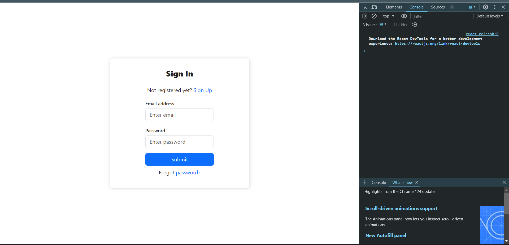
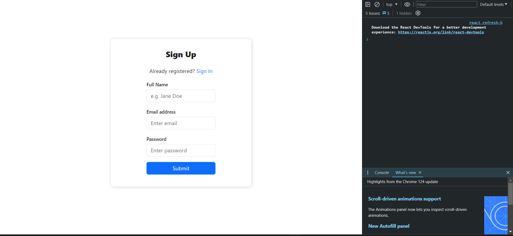
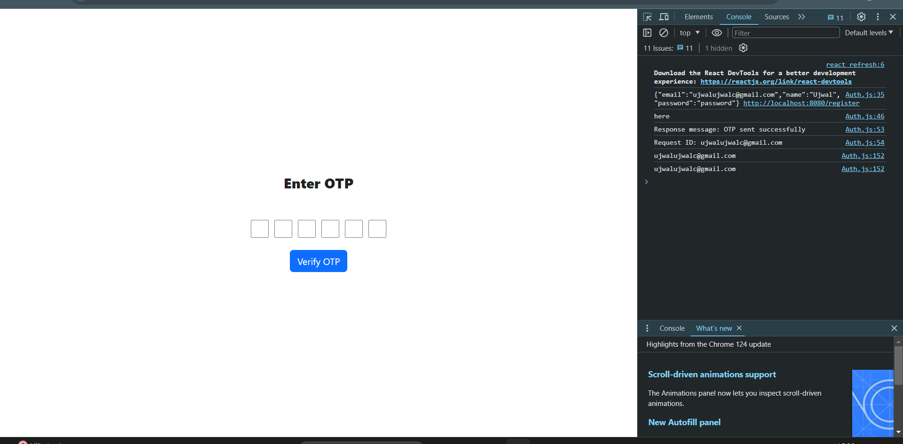
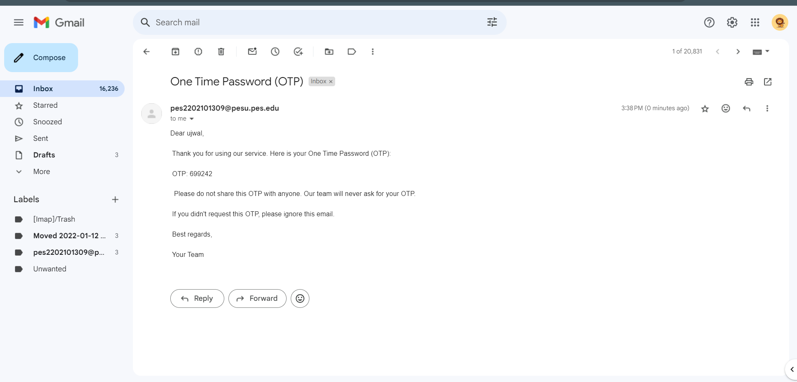
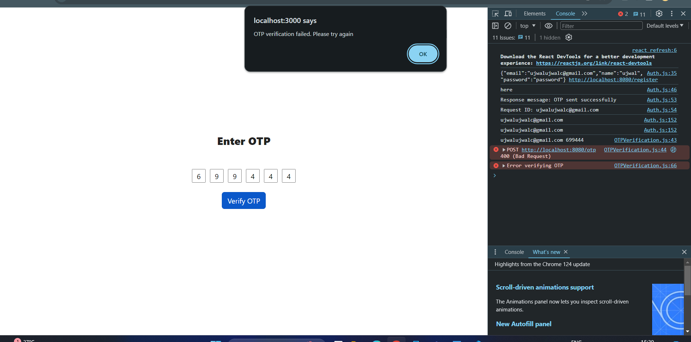
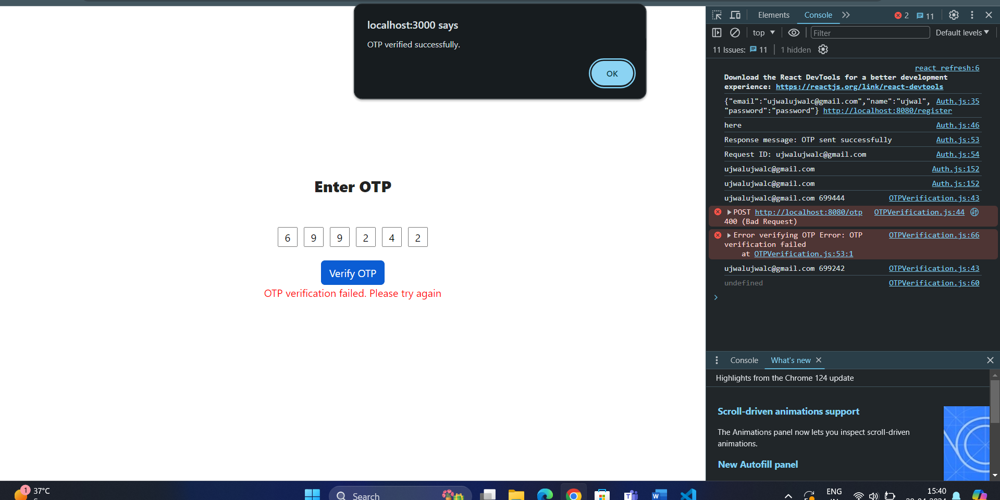
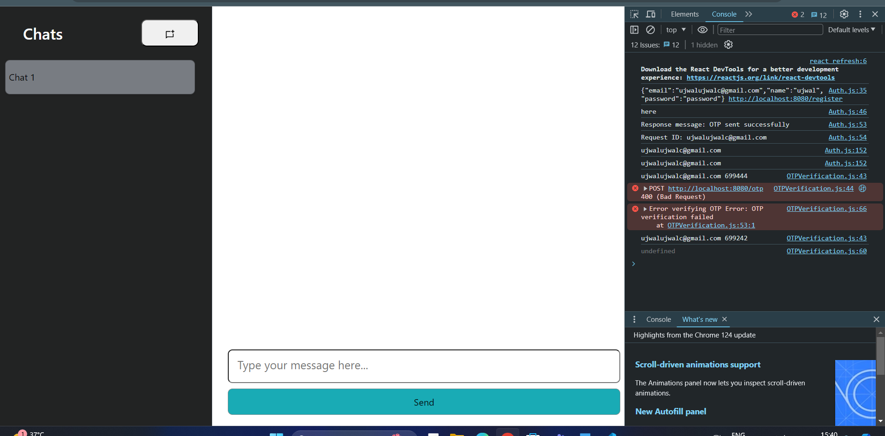
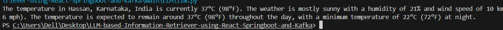
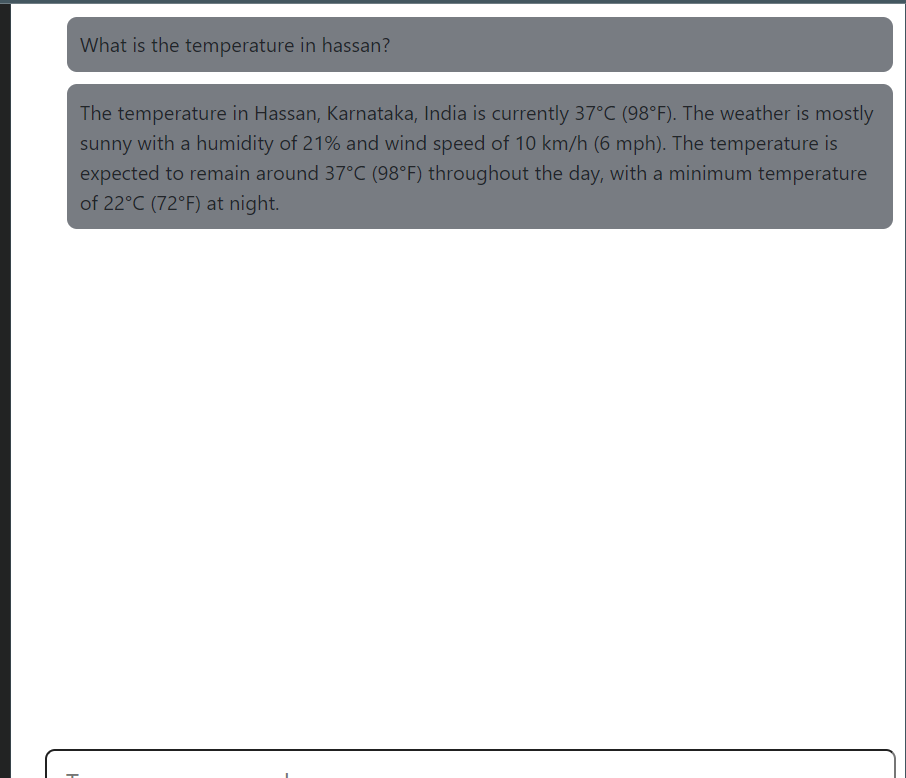

# Chat-Based Query Handling System

This project is designed to process user queries, store chat history, and manage user authentication and authorization with secure token-based verification.

## Components and Flow

### Buffer
- **Features**: Handles states such as Empty, Buffering, and Full.
- **Function**: Buffers incoming user requests until they are processed.

### LoadBalancerKafka
- **Feature**: Efficiently distributes load among multiple processing units.
- **Function**: Distributes buffered requests to the LLM (Large Language Model) for processing.

### LLM (Large Language Model)
- **Feature**: Supports integration with multiple LLMs for enhanced query processing.
- **Function**: Processes user queries, extracts data via web scrapers or APIs, and returns relevant information to the user.

### HeartbeatMonitor
- **Features**: Regularly checks system status, with a 40-second timeout for responsiveness.
- **Function**: Monitors system responsiveness, transitioning to an unresponsive state if no heartbeat is received.

### Chat
- **Features**: Manages user interactions, including opening and closing chats.
- **Function**: Manages the user chat interface. Logs chat history, which is stored in a vector database for efficient retrieval using a Retrieval-Augmented Generation (RAG) approach.

### Scrapers and APIs
- **Features**: Integrates with various data sources for comprehensive query responses.
- **Function**: Extracts data from external sources as required by user queries.

### Signup and Login
- **Features**: Incorporates OTP verification and secure token generation.
- **Function**: Handles user authentication and authorization. An OTP is sent via email for verification. Upon successful login, generates a 128-character auth token.

### SQL Database
- **Features**: Stores user data securely and supports complex queries.
- **Function**: Stores user chats, profile data, and login credentials. Executes SQL queries as part of the data processing flow.

### Auth Flow
- **Features**: Secure and persistent session management.
- **Function**: Uses OTP verification during signup and login. Post-login, a 128-character auth token is generated and cached to prevent re-login upon browser reload. This token is valid for one day.

## Key Features

- **Scalability**: The architecture supports the integration of various LLMs, enhancing its capability to process data from search engines and answer user questions accurately based on their interactions.
- **Secure Authentication**: Incorporates OTP verification and token-based authentication for secure user access.
- **Persistent Session**: Caches the auth token to maintain user sessions across browser reloads, improving user experience.
- **Efficient Data Retrieval**: Utilizes a vector database and RAG approach for storing and retrieving chat history, ensuring quick access to relevant information.

This architecture provides a robust foundation for building a scalable and secure chat-based query handling system, leveraging modern techniques in data retrieval and user authentication.

## Architecture


## How to Run

1. **Setup Environment Variables**
   - Fill up all the required credentials in the `.env` file.

2. **Install Python Dependencies**
   ```bash
   pip install -r requirements.txt
   ```

3. **Setup the Database**
   - Run `sql.py` to set up the database.
   ```bash
   python sql.py
   ```

4. **Run the Backend (FastAPI)**
   - Change directory to the main folder and run the FastAPI app.
   ```bash
   cd main
   uvicorn main:app --reload
   ```

5. **Run the Backend (Spring Boot)**
   - Change to the backend directory, make necessary installations, and run the Spring Boot app.
   ```bash
   cd ../backend
   # Make necessary installations
   ./mvnw spring-boot:run
   ```

6. **Run the Frontend (React)**
   - Come back to the main directory, go to the frontend directory, make necessary installations, and run the React app.
   ```bash
   cd ../frontend
   # Make necessary installations
   npm install
   npm start
   ```

Follow these steps to set up and run the project successfully.

## Output













